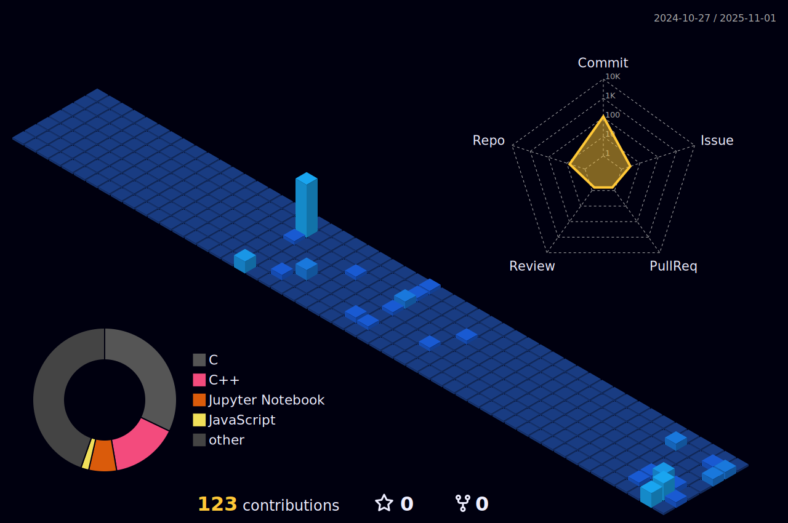

# Hi, I'm Michelangelo Marconi!

  

## About Me

I'm a passionate Computer Engineer with a strong foundation in programming and an ever-growing expertise in various technologies and frameworks. My academic journey 🎓 has not only deepened my understanding of software development, but has also given me hands-on experience in optimizing software solutions and building robust network infrastructures.

Though my formal work experience is still in its early stages (thanks to internships in the IT sector), I’ve been actively involved in challenging projects that have allowed me to sharpen both my technical and soft skills. A milestone in my journey was my participation in the Huawei ICT Academy, where I had the privilege of competing in:

2nd place in the Huawei ICT European Competition with my team, showcasing excellence in network infrastructure design and device programming.
2nd place in the Huawei ICT Global Final in China with my team, demonstrating top-tier problem-solving and collaboration skills on an international stage.
These experiences pushed me to thrive in high-pressure environments, and gave me the chance to enhance my abilities in teamwork, leadership, and cross-cultural communication.

Beyond technical proficiency, I’m deeply committed to continuous learning, collaboration, and innovation—qualities I believe are essential for success in the ever-evolving world of IT. I’m always eager to take on new challenges, expand my skill set, and contribute to projects that make a real difference.

## Social Media

- **LinkedIn**: [linkedin.com/MichelangeloMarconi](https://www.linkedin.com/in/michelangelo-marconi-9128942bb/)
- **Instagram**: [instagram.com/pg_markk](https://www.instagram.com/pg_markk/)

## Technologies & Tools

### Programming Languages

     &nbsp;&nbsp;
     &nbsp;&nbsp;
     &nbsp;&nbsp;
     &nbsp;&nbsp;
    
     &nbsp;&nbsp;
     &nbsp;&nbsp;

### Frameworks & Libraries

     &nbsp;&nbsp;
    

### Tools & Other Technologies

     &nbsp;&nbsp;
     &nbsp;&nbsp;
     &nbsp;&nbsp;
     &nbsp;&nbsp;
    

### Networking

     &nbsp;&nbsp;
     &nbsp;&nbsp;
     &nbsp;&nbsp;

 

## GitHub Stats

  

## Achievements

- **Huawei ICT European Competition**: 2nd place with my team for excellence in network infrastructure and device programming.
- **Huawei ICT Global Final in China**: 2nd place with my team, demonstrating high-level problem-solving and collaboration skills.
- **HCIA Huawei Network Certification**: Completed certification in network configuration and troubleshooting.
- **Bachelor's Degree in Computer Engineering and Automation**: Graduated from Politecnico delle Marche with a solid foundation in computer science, network systems, and automation technologies.

## Work in Progress

- **Master's Degree in Computer Engineering**: Currently pursuing my Master's degree in Computer Engineering at Politecnico di Torino.
- **Top Secret**: Stay tuned for something exciting...

## Contact Me

Feel free to reach out for collaborations or just a friendly chat!

- **Email**: [mikimarconi2001@gmail.com](mailto:mikimarconi2001@gmail.com)
- **LinkedIn**: [linkedin.com/MichelangeloMarconi](https://www.linkedin.com/in/michelangelo-marconi-9128942bb/)
